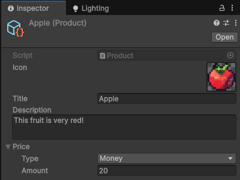

# Проект "Shop"

## Описание проекта
В данном проекте реализована система покупки продуктов через магазин. Система разработана на основе паттернов проектирования семейства MVx, а именно:
*   **MVP (Model-View-Presenter) с вариацией Observer**
*   **MVP (Model-View-Presenter) с вариацией Presentation Model**

## Ключевые особенности и архитектура

### Расширяемость
Система спроектирована с высокой степенью гибкости и расширяемости. Добавление нового товара (будь то арбуз, киви, тыква и т.п.) осуществляется просто и интуитивно понятно через редактор Unity.

  
  
  

### Реализация новых товаров
Для добавления нового типа товара необходимо:
1.  Создать новый **ScriptableObject**.
2.  Заполнить его параметры (название, цена, иконка и др.) в окне инспектора.
3.  Прокинуть в массив созданный товар. Массив находится в UIInstaller.

  

Такой подход минимизирует написание нового кода и позволяет дизайнерам и геймдизайнерам легко настраивать ассортимент магазина.
